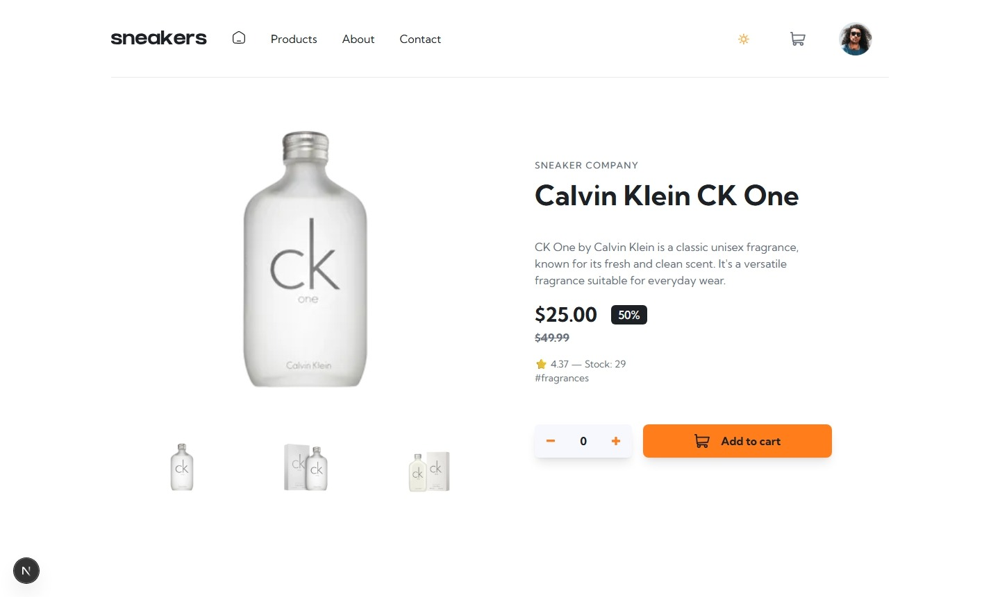
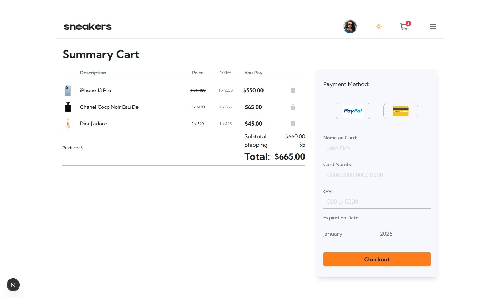
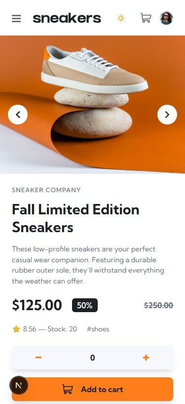

# E-commerce Product Page solution

This is a solution to the [E-commerce product page challenge on Frontend Mentor](https://www.frontendmentor.io/challenges/ecommerce-product-page-UPsZ9MJp6). Frontend Mentor challenges help you improve your coding skills by building realistic projects.

## Table of contents

- [Frontend Mentor - Conference ticket generator solution](#frontend-mentor---conference-ticket-generator-solution)
## 📑 Table of contents
  - [Overview](#overview)
    - [The challenge](#the-challenge)
    - [Screenshot](#screenshot)
    - [Live Deploys](#links)
  - [My process](#my-process)
    - [Built with](#built-with)
    - [What I learned](#what-i-learned)
    - [Continued development](#continued-development)
  - [Author](#author)

## 📌 Overview

### The challenge

Users should be able to:

- View the optimal layout for the site depending on their device's screen size
- See hover states for all interactive elements on the page
- Receive an error message when the newsletter form is submitted if:
  - The input field is empty
  - The email address is not formatted correctly

### Screenshot

  
  &nbsp;&nbsp;&nbsp;&nbsp;&nbsp;&nbsp;
  
  &nbsp;&nbsp;&nbsp;&nbsp;&nbsp;&nbsp;
   
  &nbsp;&nbsp;&nbsp;&nbsp;&nbsp;&nbsp;
  
  &nbsp;&nbsp;&nbsp;&nbsp;&nbsp;&nbsp;
  
  &nbsp;&nbsp;&nbsp;&nbsp;&nbsp;&nbsp;
   
  &nbsp;&nbsp;&nbsp;&nbsp;&nbsp;&nbsp;
   
  &nbsp;&nbsp;&nbsp;&nbsp;&nbsp;&nbsp;
  
  &nbsp;&nbsp;&nbsp;&nbsp;&nbsp;&nbsp;
   
  &nbsp;&nbsp;&nbsp;&nbsp;&nbsp;&nbsp;
   
  &nbsp;&nbsp;&nbsp;&nbsp;&nbsp;&nbsp;
   
  &nbsp;&nbsp;&nbsp;&nbsp;&nbsp;&nbsp;

## Author

- Website - [Carla Johanna](https://github.com/devcjoha)
- Frontend Mentor - [@devcjoha](https://www.frontendmentor.io/profile/devcjoha)
- X - [@CarlitaJohanna](https://www.x.com/carlitajohana)

### Links

- Solution URL: [code](https://github.com/devcjoha/ecommerce-product-page)
- Live Site URL: [Deploy-Github-Pages](https://devcjoha.github.io/ecommerce-product-page/)

## My process

 &nbsp;&nbsp;&nbsp;&nbsp;&nbsp;&nbsp;

 &nbsp;&nbsp;&nbsp;&nbsp;&nbsp;&nbsp;

 &nbsp;&nbsp;&nbsp;&nbsp;&nbsp;&nbsp;

 &nbsp;&nbsp;&nbsp;&nbsp;&nbsp;&nbsp;

 &nbsp;&nbsp;&nbsp;&nbsp;&nbsp;&nbsp;

### 🛠 Built with
- **Next.js 16** (with Turbopack for faster dev builds)  
- **React** (component-based architecture)  
- **TypeScript** (type safety and maintainability)  
- **TailwindCSS** (utility-first styling with custom properties)  
- **GitHub Pages** (static deploy with `next export`)  
- **Functional components and hooks** (`useState`, `useEffect`, `useContext`)  
- **Responsive design** (grid + flexbox patterns)  
- **Form validation** (error handling for newsletter input)  
- **ProductsProvider** (context-based state management for pagination and categories)  

### What I learned
- How to structure a **ProductsProvider** that manages global state with `Context`, including `limit`, `skip`, `page`, and `total` for pagination.

- Handling **real pagination** with API data (`limit`, `skip`, `total`) and fallback when `total` is 0 in category endpoints.

- Implementing a **loader with a top-line style progress bar** that reflects the loading status of fetches and provides immediate feedback to the user.

- How to separate the `ProductsProvider` at the page level to avoid side effects in other views (e.g., Home).

- Validating initial states (`total=0`) and conditional rendering to avoid displaying "0 of 0" in pagination.

- Using **TailwindCSS** to style common components (dropdowns, cards, overlays) with accessible visual feedback. - Organizing folders between `components/common`, `lib`, and `utils` to separate logic, helpers, and shared UI.

- Preparing the project for deployment to GitHub Pages using `next export`, correctly configuring `basePath` and `assetPrefix`.
- Using **grid layout** to overlay background shapes and images cleanly.
- Defensive patterns for favicon overwrite and static asset resolution.
- How to structure context providers for theme toggling and global state.

### 🚀 Continued development
- Add animations for hero section and tab transitions.  
- Improve accessibility (ARIA attributes for FAQ accordion, dropdowns, and form validation).  
- Explore API-driven content instead of mock JSON for scalability.  
- Document deployment workflow in detail for future portfolio projects.  
- Implement advanced features: payment form with validation, user registration/authentication.  

## Author

- Website - [Carla Johanna](https://github.com/devcjoha)
- Frontend Mentor - [@devcjoha](https://www.frontendmentor.io/profile/devcjoha)
- X - [@CarlitaJohanna](https://www.x.com/carlitajohana)